# sCare 数据库 ER 图与关系说明

**项目**: 昌平区霍营街道社区养老信息分发平台
**版本**: v2.0.0
**日期**: 2026-02-24
**表数量**: 17

---

## 📊 ER 图 (Mermaid)

```mermaid
erDiagram
    %% ========================================
    %% 核心关系定义
    %% ========================================

    %% --- 用户体系 ---
    USERS ||--o| CUSTOMER_PROFILES : "一对一(user_id)"
    USERS ||--o{ USER_IDENTITIES : "一对多(user_id)"
    USERS ||--o{ NOTIFICATIONS : "一对多(user_id)"
    USERS }o--o| SERVICE_STATIONS : "多对一(station_id)"

    %% --- 多身份 → 角色/站点 ---
    USER_IDENTITIES }o--o| SERVICE_STATIONS : "多对一(station_id)"
    ROLES ||--o{ ROLE_PERMISSIONS : "一对多(role_id)"
    PERMISSIONS ||--o{ ROLE_PERMISSIONS : "一对多(permission_id)"

    %% --- 服务站点体系 ---
    SERVICE_STATIONS ||--o{ SERVICE_ZONES : "一对多(station_id)"
    SERVICE_STATIONS ||--o{ SERVICE_REQUESTS : "一对多(station_id)"
    SERVICE_STATIONS ||--o{ TASK_ASSIGNMENTS : "一对多(station_id)"
    SERVICE_STATIONS ||--o{ BANNERS : "一对多(station_id)"
    SERVICE_STATIONS ||--o{ REPORTS : "一对多(station_id)"

    %% --- 服务流程链 ---
    USERS ||--o{ SERVICE_REQUESTS : "一对多(user_id)"
    SERVICE_REQUESTS ||--o{ TASK_ASSIGNMENTS : "一对多(request_id)"
    SERVICE_REQUESTS ||--o{ TASK_HISTORIES : "一对多(request_id)"
    TASK_ASSIGNMENTS ||--o{ TASK_HISTORIES : "一对多(task_id)"
    TASK_ASSIGNMENTS }o--o| USERS : "多对一(staff_id)"

    %% --- 内容管理 ---
    NEWS }o--o| SERVICE_STATIONS : "多对一(station_id)"
    NEWS }o--o| USERS : "多对一(author_id)"

    %% ========================================
    %% 用户表
    %% ========================================
    USERS {
        bigint id PK "主键ID"
        varchar phone UK "手机号(登录账号)"
        varchar password_hash "密码哈希(bcrypt)"
        varchar name "用户姓名"
        varchar email "邮箱地址"
        varchar avatar "头像URL"
        varchar gender "性别(male/female/other)"
        date birth_date "出生日期"
        varchar id_card "身份证号(AES加密,64位)"
        varchar id_card_hmac "身份证HMAC(检索用)"
        varchar id_card_masked "身份证脱敏显示"
        bigint station_id FK "关联站点ID(逻辑外键)"
        varchar status "状态(active/inactive/suspended)"
        datetime created_at "创建时间"
        datetime updated_at "更新时间"
        datetime deleted_at "删除时间(软删除)"
    }

    %% ========================================
    %% 用户身份表(多身份支持)
    %% ========================================
    USER_IDENTITIES {
        bigint id PK "主键ID"
        bigint user_id FK "用户ID(逻辑外键)"
        varchar identity_type "身份类型: admin/station_manager/staff/elderly/family"
        boolean is_primary "是否主身份"
        bigint station_id FK "关联站点ID(B端身份)"
        varchar status "状态(active/inactive)"
        datetime granted_at "授予时间"
        bigint granted_by "授予人ID"
        datetime revoked_at "撤销时间"
        datetime created_at "创建时间"
        datetime updated_at "更新时间"
        datetime deleted_at "删除时间(软删除)"
    }

    %% ========================================
    %% 客户档案表(原 elderly_profiles)
    %% ========================================
    CUSTOMER_PROFILES {
        bigint id PK "主键ID"
        bigint user_id UK "用户ID(逻辑外键,唯一)"
        varchar id_card "身份证号(AES加密)"
        text address "居住地址"
        decimal latitude "纬度(10,7)"
        decimal longitude "经度(10,7)"
        varchar customer_type "客户类型: elderly/disabled/pregnant/child/other"
        json emergency_contact "紧急联系人(JSON)"
        varchar gender "性别"
        date birth_date "出生日期"
        varchar health_status "健康状况"
        varchar disability_level "残障等级: 无/轻度/中度/重度"
        text medical_history "病史"
        text special_needs "特殊需求"
        datetime created_at "创建时间"
        datetime updated_at "更新时间"
        datetime deleted_at "删除时间(软删除)"
    }

    %% ========================================
    %% 角色表
    %% ========================================
    ROLES {
        bigint id PK "主键ID"
        varchar code UK "角色编码(admin/staff等)"
        varchar name "角色名称"
        varchar description "角色描述"
        boolean is_system "是否系统内置角色"
        varchar status "状态(active/inactive)"
        int sort "排序号"
        datetime created_at "创建时间"
        datetime updated_at "更新时间"
        datetime deleted_at "删除时间(软删除)"
    }

    %% ========================================
    %% 权限表
    %% ========================================
    PERMISSIONS {
        bigint id PK "主键ID"
        varchar code UK "权限编码(module:resource:action)"
        varchar name "权限名称"
        varchar description "权限描述"
        varchar module "所属模块"
        varchar type "权限类型(menu/button/resource)"
        bigint parent_id "父权限ID(0为顶级)"
        varchar api_path "API路径(支持通配符*)"
        varchar api_method "HTTP方法(GET/POST/PUT/DELETE)"
        boolean is_public "是否公开(无需授权)"
        varchar status "状态(active/inactive)"
        int sort "排序号"
        datetime created_at "创建时间"
        datetime updated_at "更新时间"
        datetime deleted_at "删除时间(软删除)"
    }

    %% ========================================
    %% 角色-权限关联表
    %% ========================================
    ROLE_PERMISSIONS {
        bigint id PK "主键ID"
        bigint role_id FK "角色ID(逻辑外键)"
        bigint permission_id FK "权限ID(逻辑外键)"
        datetime created_at "创建时间"
    }

    %% ========================================
    %% 菜单表
    %% ========================================
    MENUS {
        bigint id PK "主键ID"
        bigint parent_id "父菜单ID(0为顶级)"
        varchar name "菜单名称"
        varchar path "前端路由路径"
        varchar component "前端组件路径"
        varchar icon "菜单图标"
        varchar permission_code "关联权限编码"
        int sort "排序号(越小越靠前)"
        boolean hidden "是否隐藏"
        varchar status "状态(active/inactive)"
        datetime created_at "创建时间"
        datetime updated_at "更新时间"
        datetime deleted_at "删除时间(软删除)"
    }

    %% ========================================
    %% 服务站点表
    %% ========================================
    SERVICE_STATIONS {
        bigint id PK "主键ID"
        varchar name "站点名称"
        varchar code UK "站点编码"
        varchar address "详细地址"
        varchar phone "联系电话"
        decimal latitude "纬度(10,7)"
        decimal longitude "经度(10,7)"
        varchar service_area "服务范围描述"
        bigint capacity "服务容量(默认10)"
        varchar work_hours "工作时间"
        varchar status "状态(active/inactive)"
        datetime created_at "创建时间"
        datetime updated_at "更新时间"
        datetime deleted_at "删除时间(软删除)"
    }

    %% ========================================
    %% 服务围栏表
    %% ========================================
    SERVICE_ZONES {
        bigint id PK "主键ID"
        bigint station_id FK "关联站点ID(逻辑外键)"
        varchar name "围栏名称"
        json points "多边形顶点[[lng,lat],...]"
        bigint priority "优先级(数字越大越高)"
        varchar status "状态(active/inactive)"
        datetime created_at "创建时间"
        datetime updated_at "更新时间"
        datetime deleted_at "删除时间(软删除)"
    }

    %% ========================================
    %% 服务需求表
    %% ========================================
    SERVICE_REQUESTS {
        bigint id PK "主键ID"
        varchar request_no UK "需求编号(唯一)"
        bigint user_id FK "提交用户ID(逻辑外键)"
        varchar service_type "服务类型(常量定义)"
        varchar status "需求状态"
        text description "需求详细描述"
        decimal submit_location_lat "提交位置纬度"
        decimal submit_location_lng "提交位置经度"
        varchar contact_name "联系人姓名"
        varchar contact_phone "联系电话"
        varchar address "详细地址"
        datetime appointment_time "预约时间"
        varchar urgency "紧急程度(normal/urgent)"
        bigint station_id FK "分配站点ID(逻辑外键)"
        text reject_reason "拒绝原因"
        json images "图片URL列表"
        bigint rating "服务评分(1-5)"
        text feedback "用户评价"
        datetime created_at "创建时间"
        datetime updated_at "更新时间"
        datetime deleted_at "删除时间(软删除)"
    }

    %% ========================================
    %% 任务分配表
    %% ========================================
    TASK_ASSIGNMENTS {
        bigint id PK "主键ID"
        bigint request_id FK "关联需求ID(逻辑外键)"
        bigint station_id FK "分配站点ID(逻辑外键)"
        bigint staff_id FK "认领工作人员ID(逻辑外键)"
        varchar status "任务状态"
        datetime claimed_at "认领时间"
        datetime completed_at "完成时间"
        bigint rating "服务评分(1-5)"
        text feedback "用户评价"
        text staff_notes "工作人员备注"
        json images "完成照片URL列表"
        datetime created_at "创建时间"
        datetime updated_at "更新时间"
        datetime deleted_at "删除时间(软删除)"
    }

    %% ========================================
    %% 任务历史表
    %% ========================================
    TASK_HISTORIES {
        bigint id PK "主键ID"
        bigint task_id FK "关联任务ID(逻辑外键)"
        bigint request_id FK "关联需求ID(逻辑外键)"
        varchar action "操作类型"
        bigint operator_id FK "操作人ID(逻辑外键)"
        bigint from_staff_id FK "转派来源工作人员ID"
        bigint to_staff_id FK "转派目标工作人员ID"
        bigint from_station_id FK "转派来源站点ID"
        bigint to_station_id FK "转派目标站点ID"
        varchar status_before "操作前状态"
        varchar status_after "操作后状态"
        text remark "备注说明"
        datetime created_at "创建时间"
        datetime updated_at "更新时间"
        datetime deleted_at "删除时间(软删除)"
    }

    %% ========================================
    %% 通知表
    %% ========================================
    NOTIFICATIONS {
        bigint id PK "主键ID"
        bigint user_id FK "接收用户ID(逻辑外键)"
        varchar title "通知标题"
        text body "通知内容"
        varchar type "通知类型"
        bigint related_id "关联业务ID"
        varchar related_type "关联业务类型(request/task)"
        varchar channel "渠道(in_app/email/sms)"
        varchar send_status "发送状态(pending/sent/failed)"
        datetime sent_at "发送时间"
        boolean is_read "是否已读"
        datetime read_at "阅读时间"
        bigint retry_count "重试次数"
        datetime created_at "创建时间"
        datetime updated_at "更新时间"
        datetime deleted_at "删除时间(软删除)"
    }

    %% ========================================
    %% 轮播图表
    %% ========================================
    BANNERS {
        bigint id PK "主键ID"
        bigint station_id FK "站点ID(0=全局/通用)"
        varchar title "标题"
        varchar image_url "图片URL"
        varchar link_type "链接类型(none/news/url)"
        varchar link_value "链接值(新闻ID或URL)"
        int sort "排序号(越小越靠前)"
        varchar status "状态(active/inactive)"
        datetime created_at "创建时间"
        datetime updated_at "更新时间"
        datetime deleted_at "删除时间(软删除)"
    }

    %% ========================================
    %% 新闻资讯表
    %% ========================================
    NEWS {
        bigint id PK "主键ID"
        bigint station_id FK "站点ID(NULL=全局)"
        varchar title "标题"
        varchar summary "摘要"
        text content "正文内容"
        varchar cover_url "封面图URL"
        varchar type "类型(news/notice/activity)"
        varchar status "状态(draft/published/archived)"
        bigint author_id FK "作者ID(逻辑外键)"
        datetime publish_at "发布时间"
        bigint view_count "浏览量"
        datetime created_at "创建时间"
        datetime updated_at "更新时间"
        datetime deleted_at "删除时间(软删除)"
    }

    %% ========================================
    %% 报表记录表
    %% ========================================
    REPORTS {
        bigint id PK "主键ID"
        varchar name "报表名称"
        varchar type "报表类型(service/performance/request/station)"
        varchar format "文件格式(xlsx/csv)"
        varchar file_path "文件存储路径"
        bigint file_size "文件大小(字节)"
        bigint station_id FK "站点ID(NULL=全局)"
        date start_date "统计开始日期"
        date end_date "统计结束日期"
        bigint created_by FK "创建人ID"
        datetime created_at "创建时间"
        datetime updated_at "更新时间"
        datetime deleted_at "删除时间(软删除)"
    }

    %% ========================================
    %% 数据库迁移记录表
    %% ========================================
    SCHEMA_MIGRATIONS {
        bigint id PK "主键ID"
        varchar filename UK "迁移脚本文件名"
        datetime applied_at "执行时间"
    }
```



---

## 🔗 实体关系详解

### 业务域划分

| 业务域 | 涉及表 | 说明 |
|--------|--------|------|
| 用户体系 | users, user_identities, customer_profiles | 用户账号 + 多身份 + 档案 |
| 权限体系 | roles, permissions, role_permissions, menus | RBAC + 动态菜单 |
| 地理围栏 | service_stations, service_zones | 站点 + 多边形围栏 |
| 服务流程 | service_requests, task_assignments, task_histories | 需求→任务→历史 |
| 通知系统 | notifications | 多渠道通知 |
| 内容运营 | news, banners | 新闻 + 轮播图 |
| 数据中心 | reports | 报表生成记录 |
| 基础设施 | schema_migrations | 数据库版本管理 |

---

### 1. Users ↔ UserIdentities (一对多)

**关系类型**: 1:N
**逻辑外键**: `user_identities.user_id` → `users.id`
**约束**: NOT NULL

**业务含义**:
- 一个用户可拥有**多个身份**（替代旧的单一 `role` 字段）
- B 端身份: `admin`、`station_manager`、`staff`
- C 端身份: `elderly`、`family`
- `is_primary` 标记主身份，JWT 的 `primary_role` 取自此处

**示例**:
```
用户: 张站长(id=2)
身份:
  - identity_type=station_manager, station_id=1, is_primary=true
  - identity_type=staff, station_id=1, is_primary=false
```

---

### 2. Users ↔ CustomerProfiles (一对一)

**关系类型**: 1:1
**逻辑外键**: `customer_profiles.user_id` → `users.id`
**约束**: `user_id` 唯一索引

**业务含义**:
- C 端用户的详细档案（地址、健康状况、紧急联系人等）
- `customer_type` 支持多种客户类型: elderly/disabled/pregnant/child/other
- `emergency_contact` 使用 JSON 存储（包含姓名、电话、关系）

---

### 3. RBAC 权限体系 (Roles ↔ Permissions ↔ Menus)

**关系链**: `roles` → `role_permissions` → `permissions` ← `menus.permission_code`

**业务含义**:
- **Roles**: 角色定义（admin 跳过所有权限检查）
- **Permissions**: 权限定义，支持 `menu`/`button`/`resource` 三种类型
- **RolePermissions**: 角色-权限多对多关联
- **Menus**: 前端菜单，通过 `permission_code` 关联权限，实现动态菜单
- B 端中间件链: `AuthMiddleware` → `RequireEndType("b_end")` → `PermissionMiddleware`

---

### 4. ServiceStations ↔ ServiceZones (一对多)

**关系类型**: 1:N
**逻辑外键**: `service_zones.station_id` → `service_stations.id`
**约束**: NOT NULL

**匹配逻辑**:
1. 用户提交需求时提供经纬度
2. 系统遍历所有围栏，使用**射线法**判断点是否在多边形内
3. 如果命中多个围栏，选择**优先级最高**的
4. 如果未命中任何围栏，使用**兜底规则**（分配到最近站点）

---

### 5. Users ↔ ServiceRequests (一对多)

**关系类型**: 1:N
**逻辑外键**: `service_requests.user_id` → `users.id`
**约束**: NOT NULL

**状态流转**:
```
pending → dispatched → claimed → processing → completed
                                             → cancelled
```

---

### 6. ServiceRequests ↔ TaskAssignments (一对多)

**关系类型**: 1:N
**逻辑外键**: `task_assignments.request_id` → `service_requests.id`
**约束**: NOT NULL

**设计说明**:
- MVP 阶段一个需求对应一个任务
- 支持任务转派、重新派单的扩展场景
- 业务逻辑层控制：同一时刻只有一个 `active` 任务

---

### 7. TaskAssignments ↔ TaskHistories (一对多)

**关系类型**: 1:N
**逻辑外键**: `task_histories.task_id` → `task_assignments.id`
**约束**: NOT NULL

**操作类型 (action)**:
- `dispatched`: 派单
- `claimed`: 认领
- `transferred`: 转派
- `completed`: 完成
- `cancelled`: 取消

---

### 8. Users ↔ Notifications (一对多)

**关系类型**: 1:N
**逻辑外键**: `notifications.user_id` → `users.id`
**约束**: NOT NULL

**多态关联**: 通过 `related_id` + `related_type` 关联不同业务实体

---

### 9. 内容管理 (Banners / News)

- **Banners**: `station_id=0` 表示全局轮播，非零则站点专属
- **News**: `station_id=NULL` 表示全局资讯，支持 `news`/`notice`/`activity` 三种类型
- **News.author_id**: 关联发布者用户

---

### 10. Reports (报表记录)

- 记录报表生成的元数据（类型、时间范围、文件路径）
- `station_id=NULL` 表示全局报表
- `created_by` 关联生成报表的操作人

---

## 📈 核心业务流程

### 流程1: 需求提交 → 任务派单 → 完成 → 评价

```
┌─────────────┐
│  用户提交需求  │ service_requests: status=pending
└──────┬──────┘
       │
       ▼
┌─────────────┐
│ 地理围栏匹配  │ service_zones: 射线法(Ray Casting)
└──────┬──────┘
       │
       ▼
┌─────────────┐
│ 自动派单到站点 │ service_requests: station_id 填充, status=dispatched
│              │ task_assignments: 创建任务记录
│              │ task_histories: action=dispatched
│              │ notifications: 通知站点工作人员
└──────┬──────┘
       │
       ▼
┌─────────────┐
│ 工作人员认领  │ task_assignments: staff_id 填充, status=claimed
│              │ task_histories: action=claimed
└──────┬──────┘
       │
       ▼
┌─────────────┐
│  处理任务     │ task_assignments: status=processing
└──────┬──────┘
       │
       ▼
┌─────────────┐
│  完成任务     │ task_assignments: status=completed, completed_at 填充
│              │ service_requests: status=completed
│              │ task_histories: action=completed
│              │ notifications: 通知用户任务完成
└──────┬──────┘
       │
       ▼
┌─────────────┐
│  用户评价     │ service_requests: rating + feedback 填充
│              │ task_assignments: rating + feedback 填充
└─────────────┘
```

### 流程2: 任务转派

```
┌─────────────┐
│ 工作人员A认领 │ task_assignments: staff_id=A, status=claimed
└──────┬──────┘
       │
       ▼
┌──────────────┐
│ 站长/A发起转派 │ 旧任务: status=transferred
│              │ 新任务: staff_id=B, status=dispatched
│              │ task_histories: from_staff_id=A, to_staff_id=B
└──────┬──────┘
       │
       ▼
┌─────────────┐
│ 工作人员B处理 │ → 完成
└─────────────┘
```

### 流程3: 需求编辑/取消

```
┌─────────────┐
│  用户编辑需求  │ service_requests: 仅 status=pending 可编辑
└─────────────┘

┌─────────────┐
│  用户取消需求  │ service_requests: status → cancelled
│              │ task_assignments: status → cancelled (如已派单)
│              │ task_histories: action=cancelled
└─────────────┘
```

---

## 🔍 关键设计决策说明

### 为什么用 user_identities 替代 users.role？

**原因**:
1. **多身份支持**: 一个用户可同时拥有 B 端和 C 端身份
2. **身份管理**: 支持授予/撤销/冻结单个身份，不影响其他身份
3. **审计追溯**: 记录身份变更历史（granted_at/granted_by/revoked_at）
4. **站点隔离**: B 端身份可绑定不同站点

### 为什么 service_requests 和 task_assignments 都有 rating/feedback？

**原因**: 数据冗余设计，服务于不同查询场景
- `service_requests.rating/feedback`: C 端用户查看自己的评价记录
- `task_assignments.rating/feedback`: B 端统计工作人员的服务评分

### 为什么使用逻辑外键而非数据库外键？

1. **灵活性**: 避免级联删除带来的数据丢失风险
2. **性能**: 减少数据库锁竞争，提升并发性能
3. **软删除友好**: GORM 软删除机制下，外键约束会导致问题
4. **分布式友好**: 未来可能拆分数据库，逻辑外键更灵活

### 为什么地理围栏使用 JSON 而非 GEOMETRY？

| 方案 | 优势 | 劣势 |
|------|------|------|
| JSON + 射线法 | 灵活、易调试、跨数据库 | 无空间索引 |
| GEOMETRY + ST_Contains | 空间索引优化 | 复杂、调试困难 |

当前业务规模小（<100 个围栏），JSON 方案性能足够（18ms）。

### 为什么身份证号使用加密存储？

- `id_card`: AES-256 加密存储（varchar 64）
- `id_card_hmac`: HMAC 摘要，用于精确检索（无需解密即可查询）
- `id_card_masked`: 脱敏显示（如 `110***********1234`），用于前端展示

---

## 📚 参考文档

- [数据库表结构脚本](schema/schema.sql)
- [种子数据](seeds/seed_all.sql)
- [数据库初始化文档](README.md)

---

**维护者**: sCare 开发团队
**最后更新**: 2026-02-24
