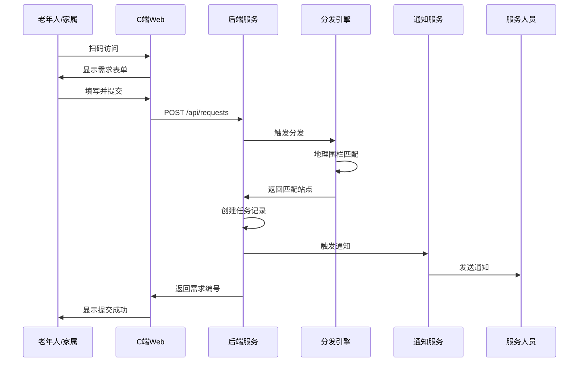
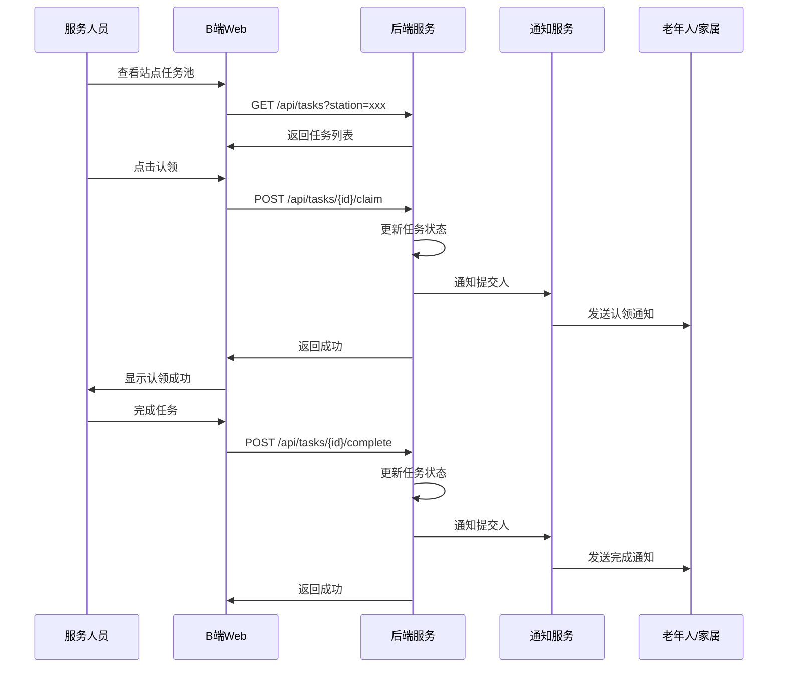
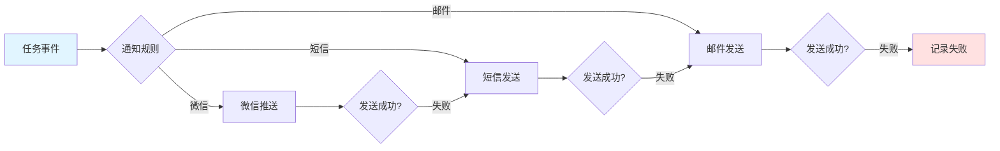

# PRD - 基于地理围栏的社区养老信息分发平台

**版本**：v1.0
**日期**：2026年1月10日
**对应论文章节**：第二章 需求分析

---

## 1. 项目背景

### 1.1 问题陈述

在昌平区霍营街道社区养老服务实际运行过程中，存在以下问题：

| 问题 | 现状描述 | 影响 |
|------|---------|------|
| **渠道分散** | 需求通过电话、微信群、线下登记等方式上报 | 缺乏统一入口，信息收集不全 |
| **人工派单** | 依靠人工整理和转发完成任务派发 | 响应不及时，效率低下 |
| **责任不清** | 缺乏明确的分发规则和责任界定 | 处理过程不透明，追溯困难 |
| **空间脱节** | 未结合社区站点和服务人员的空间分布 | 无法实现精准派单 |
| **使用门槛** | 老年人智能设备操作能力有限 | 需求提交不便 |

### 1.2 项目目标

设计并实现一个基于地理围栏的社区养老信息分发平台，实现：

1. **统一信息入口**：通过二维码为老年人及家属提供便捷的需求提交方式
2. **智能自动分发**：基于地理围栏规则自动将需求分发至对应社区站点任务池
3. **处理过程透明**：全流程状态跟踪，责任界定清晰
4. **降低使用门槛**：老年人友好的界面设计，支持PWA离线访问

### 1.3 应用场景

**目标用户群体**：
- 老年人（60岁以上，包括失能、半失能人群）
- 老年人家属
- 社区工作人员
- 社区服务人员
- 系统管理员

**适用服务类型**：
- 助餐服务（送餐、配餐）
- 生活照料（保洁、洗衣）
- 医疗护理（陪诊、送药）
- 精神慰藉（陪伴、聊天）
- 其他服务

---

## 2. 业务现状分析（霍营街道调研）

### 2.1 当前服务流程

```
┌─────────────┐
│  老年人/家属 │
└──────┬──────┘
       │ 需求产生
       ↓
┌───────────────────────────────────────┐
│        现有上报渠道                    │
├─────────┬─────────┬───────────────────┤
│  电话   │ 微信群  │   线下登记        │
└────┬────┴────┬────┴────┬──────────────┘
     │         │         │
     └─────────┴─────────┴────→ 人工整理
                                ↓
                          社区工作人员
                                ↓
                          人工判断派单
                                ↓
                          服务人员处理
```

### 2.2 现状痛点分析

| 痛点 | 具体表现 | 数据支持（估算） |
|------|---------|----------------|
| 响应延迟 | 平均响应时间 > 4小时 | 缺乏实时通知机制 |
| 信息遗漏 | 微信群消息容易被覆盖 | 约15%需求被忽略 |
| 责任模糊 | 无法追溯处理责任人 | 投诉处理困难 |
| 派单不精准 | 未考虑服务人员位置 | 往返时间浪费 |
| 统计困难 | 缺乏数据记录和分析 | 无法量化服务效果 |

### 2.3 期望流程

```
┌─────────────┐
│  老年人/家属 │
└──────┬──────┘
       │ 扫码/访问
       ↓
┌─────────────────┐
│  统一需求入口   │  (C端Web/PWA)
│  - 简洁表单     │
│  - 语音辅助     │
└────────┬────────┘
         │ 提交
         ↓
┌─────────────────────────────┐
│    地理围栏自动分发         │
│  - 位置匹配                 │
│  - 站点任务池               │
└────────┬────────────────────┘
         │ 自动分发
         ↓
┌─────────────────────────────┐
│      站点任务池             │
│  - 服务人员查看             │
│  - 认领/指派                │
└────────┬────────────────────┘
         │ 处理
         ↓
┌─────────────────────────────┐
│      全流程通知             │
│  - 微信/短信/邮件           │
│  - 实时状态更新             │
└─────────────────────────────┘
```

---

## 3. 用户角色定义

### 3.1 角色矩阵

| 角色 | 用户类型 | 核心职责 | 使用端 |
|------|---------|---------|--------|
| **老年人/家属** | C端用户 | 提交服务需求、查看进度 | C端Web (PWA) |
| **社区工作人员** | B端用户 | 任务管理、手动派单、统计分析 | B端工作台 |
| **服务人员** | B端用户 | 查看任务池、认领任务、反馈处理 | B端工作台 |
| **系统管理员** | B端用户 | 站点管理、围栏配置、系统设置 | B端管理后台 |

### 3.2 角色详细说明

#### 3.2.1 老年人/家属（C端用户）

**用户特征**：
- 年龄：60岁以上为主
- 数字技能：普遍较低，部分不会使用智能手机
- 视力：可能存在视力下降问题
- 操作习惯：倾向于简单直观的操作

**核心需求**：
1. 快捷提交服务需求
2. 查看需求处理进度
3. 接收处理结果通知

**使用场景**：
- 老年人自己通过扫码提交需求
- 家属代替老年人提交需求
- 查看历史需求记录

#### 3.2.2 社区工作人员（B端用户）

**用户特征**：
- 熟悉电脑操作
- 需要管理多个服务站点
- 需要统计数据支持决策

**核心需求**：
1. 查看辖区所有需求
2. 手动调整任务分配
3. 查看服务统计报表
4. 处理异常情况

**使用场景**：
- 每日工作台查看任务概况
- 手动分配特殊需求
- 生成服务统计报告

#### 3.2.3 服务人员（B端用户）

**用户特征**：
- 使用移动设备为主
- 关注分配给自己的任务
- 需要快速反馈处理结果

**核心需求**：
1. 查看站点任务池
2. 认领/接受分配的任务
3. 更新处理状态
4. 上传处理照片

**使用场景**：
- 上班时查看今日任务
- 完成任务后更新状态
- 记录服务详情

#### 3.2.4 系统管理员（B端用户）

**用户特征**：
- 技术背景或管理职责
- 负责系统配置和维护

**核心需求**：
1. 管理服务站点信息
2. 绘制和调整地理围栏
3. 管理用户和权限
4. 配置通知渠道

**使用场景**：
- 初始化系统配置
- 新增/调整服务站点
- 维护地理围栏

---

## 4. 典型应用场景

### 4.1 场景一：老年人提交助餐需求

**用户故事**：
> 75岁的张老人需要送餐服务，通过扫描社区提供的二维码，简单填写需求后提交。

**业务流程**：

| 步骤 | 角色 | 操作 | 系统响应 |
|------|------|------|---------|
| 1 | 老年人/家属 | 扫描二维码访问 | 进入需求提交页面 |
| 2 | 老年人/家属 | 选择服务类型（助餐） | 显示助餐表单 |
| 3 | 老年人/家属 | 填写地址、时间、特殊要求 | 提供语音输入辅助 |
| 4 | 老年人/家属 | 提交需求 | 显示提交成功，返回需求编号 |
| 5 | 系统 | 自动匹配地理围栏 | 分发到对应站点任务池 |
| 6 | 系统 | 发送通知给站点服务人员 | 微信/短信通知 |
| 7 | 服务人员 | 认领任务 | 状态更新为"已认领" |
| 8 | 服务人员 | 完成送餐服务 | 上传照片，更新状态 |
| 9 | 系统 | 通知老年人/家属 | 发送完成通知 |

**成功标准**：
- 老年人在3分钟内完成需求提交
- 服务人员在15分钟内收到通知
- 全程状态可查询

### 4.2 场景二：工作人员手动调整派单

**用户故事**：
> 某站点服务人员都已满负荷，工作人员需要将需求手动分配给相邻站点。

**业务流程**：

| 步骤 | 角色 | 操作 | 系统响应 |
|------|------|------|---------|
| 1 | 社区工作人员 | 发现某站点任务积压 | 在工作台看到告警 |
| 2 | 社区工作人员 | 查看相邻站点负载 | 显示各站点任务数量 |
| 3 | 社区工作人员 | 选择任务，重新分配 | 选择目标站点 |
| 4 | 系统 | 更新任务归属 | 通知新站点服务人员 |
| 5 | 社区工作人员 | 记录调整原因 | 系统保存操作日志 |

**成功标准**：
- 工作人员可快速查看站点负载
- 手动分配操作简单直观
- 操作记录完整可追溯

### 4.3 场景三：服务人员认领并完成任务

**用户故事**：
> 服务人员李师傅上班后打开工作台，看到今日任务列表，认领并完成任务。

**业务流程**：

| 步骤 | 角色 | 操作 | 系统响应 |
|------|------|------|---------|
| 1 | 服务人员 | 打开工作台 | 显示站点任务池 |
| 2 | 服务人员 | 查看任务详情 | 显示需求信息、地址、联系方式 |
| 3 | 服务人员 | 点击"认领" | 任务状态更新为"已认领" |
| 4 | 服务人员 | 联系用户确认 | 可直接拨打电话 |
| 5 | 服务人员 | 完成服务 | 点击"完成"，上传照片 |
| 6 | 服务人员 | 填写服务备注 | 记录服务详情 |
| 7 | 系统 | 自动通知用户 | 发送完成通知 |

**成功标准**：
- 任务列表清晰易读
- 认领操作一步完成
- 支持照片上传和备注

### 4.4 场景四：管理员配置地理围栏

**用户故事**：
> 系统管理员需要为新增的社区服务站配置服务区域。

**业务流程**：

| 步骤 | 角色 | 操作 | 系统响应 |
|------|------|------|---------|
| 1 | 系统管理员 | 进入围栏管理页面 | 显示地图和现有围栏 |
| 2 | 系统管理员 | 选择目标站点 | 高亮显示站点位置 |
| 3 | 系统管理员 | 绘制多边形围栏 | 实时显示覆盖范围 |
| 4 | 系统管理员 | 调整围栏边界 | 支持拖拽顶点编辑 |
| 5 | 系统管理员 | 设置围栏优先级 | 多围栏重叠时生效 |
| 6 | 系统管理员 | 保存围栏配置 | 存入数据库，立即可用 |

**成功标准**：
- 地图操作流畅
- 绘制工具易用
- 实时预览覆盖范围

---

## 5. 功能需求清单

### 5.1 C端功能（老年人/家属）

#### 5.1.1 核心功能

| 功能编号 | 功能名称 | 优先级 | 描述 |
|---------|---------|--------|------|
| C-01 | 扫码访问 | P0 | 通过二维码直接进入需求提交页面 |
| C-02 | 需求提交 | P0 | 填写服务类型、地址、时间、特殊要求 |
| C-03 | 图片上传 | P1 | 支持上传相关图片（最多3张） |
| C-04 | 进度查询 | P0 | 通过需求编号查询处理进度 |
| C-05 | 历史记录 | P1 | 查看历史需求和当前状态 |
| C-06 | 语音输入 | P1 | 语音转文字辅助填写 |
| C-07 | 一键拨号 | P1 | 快速联系服务人员 |
| C-08 | 离线支持 | P1 | PWA离线访问，联网后自动同步 |

#### 5.1.2 界面设计要求

| 设计要素 | 具体要求 |
|---------|---------|
| 字体大小 | 基础字号18px，标题24px+ |
| 对比度 | 符合WCAG AA级标准（4.5:1） |
| 点击区域 | 最小48x48px |
| 表单简化 | 单页提交，最多3步完成 |
| 反馈提示 | 操作后1秒内显示反馈 |
| 颜色使用 | 高对比度主色，避免相近色 |

### 5.2 B端功能（社区工作人员）

#### 5.2.1 核心功能

| 功能编号 | 功能名称 | 优先级 | 描述 |
|---------|---------|--------|------|
| B-01 | 工作台首页 | P0 | 显示任务统计、待处理事项 |
| B-02 | 任务列表 | P0 | 查看所有需求，支持筛选排序 |
| B-03 | 手动派单 | P0 | 手动分配任务到指定站点/人员 |
| B-04 | 任务详情 | P0 | 查看需求完整信息 |
| B-05 | 状态跟踪 | P0 | 查看任务当前状态和流转记录 |
| B-06 | 统计报表 | P1 | 需求统计、处理效率分析 |
| B-07 | 导出功能 | P1 | 导出任务列表为Excel |

### 5.3 B端功能（服务人员）

#### 5.3.1 核心功能

| 功能编号 | 功能名称 | 优先级 | 描述 |
|---------|---------|--------|------|
| S-01 | 站点任务池 | P0 | 查看本站点待认领任务 |
| S-02 | 任务认领 | P0 | 认领任务，状态更新 |
| S-03 | 我的任务 | P0 | 查看已认领的任务列表 |
| S-04 | 更新状态 | P0 | 更新任务处理状态 |
| S-05 | 上传照片 | P1 | 上传服务完成照片 |
| S-06 | 填写备注 | P1 | 记录服务详情 |
| S-07 | 联系用户 | P0 | 一键拨号联系需求提交人 |

### 5.4 B端功能（系统管理员）

#### 5.4.1 核心功能

| 功能编号 | 功能名称 | 优先级 | 描述 |
|---------|---------|--------|------|
| A-01 | 站点管理 | P0 | 增删改查服务站点 |
| A-02 | 围栏管理 | P0 | 绘制、编辑、删除地理围栏 |
| A-03 | 用户管理 | P0 | 管理用户账号和角色 |
| A-04 | 权限配置 | P1 | 配置角色权限 |
| A-05 | 通知配置 | P1 | 配置邮件、短信、微信参数 |
| A-06 | 系统日志 | P1 | 查看操作日志 |
| A-07 | 数据备份 | P2 | 数据备份与恢复 |

---

## 6. 非功能需求

### 6.1 性能需求

| 指标 | 要求 | 说明 |
|------|------|------|
| 响应时间 | 页面加载 < 2秒 | 首屏加载时间 |
| 响应时间 | API请求 < 500ms | 平均响应时间 |
| 并发用户 | 支持100并发 | 小型试点规模 |
| 数据量 | 支持10万+需求记录 | 考虑数据积累 |
| 可用性 | 99% | 非关键业务，允许计划内维护 |

### 6.2 安全需求

| 需求 | 实现方式 |
|------|---------|
| 身份认证 | JWT Token，有效期2小时 |
| 权限控制 | RBAC角色权限模型 |
| 数据传输 | HTTPS加密 |
| 数据存储 | 敏感信息加密存储 |
| 操作审计 | 记录关键操作日志 |
| 防注入 | SQL参数化查询 |
| XSS防护 | 前端输入过滤和转义 |

### 6.3 可用性需求（老年人友好）

| 需求 | 具体要求 |
|------|---------|
| 界面简洁 | 核心功能突出，减少干扰元素 |
| 操作简单 | 最多3步完成需求提交 |
| 文字清晰 | 基础字号18px，高对比度 |
| 错误提示 | 使用清晰的语言，避免技术术语 |
| 帮助引导 | 关键步骤提供操作提示 |
| 兼容性 | 支持主流浏览器（Chrome、Safari、微信浏览器） |

### 6.4 可维护性需求

| 需求 | 具体要求 |
|------|---------|
| 代码规范 | 遵循语言和框架最佳实践 |
| 注释文档 | 核心功能添加注释 |
| 日志记录 | 完整的请求和错误日志 |
| 监控告警 | 关键指标监控和异常告警 |
| 部署便捷 | Docker容器化部署 |

### 6.5 兼容性需求

| 类别 | 要求 |
|------|------|
| 浏览器 | Chrome 90+、Safari 14+、微信浏览器 |
| 设备 | PC、平板、手机 |
| 分辨率 | 支持1366x768以上 |
| 网络 | 支持4G/5G/WiFi，弱网环境可用 |

---

## 7. 业务流程图

### 7.1 需求提交与分发流程



### 7.2 任务认领与处理流程



### 7.3 多渠道通知流程



---

## 8. 信息架构图

### 8.1 C端信息架构

```
C端首页（需求提交）
├── 页面头部
│   ├── 标题
│   └── 帮助按钮
├── 需求表单
│   ├── 服务类型选择（大图标按钮）
│   ├── 联系方式（预填手机号）
│   ├── 服务地址（支持定位）
│   ├── 服务时间（日期+时间段）
│   └── 特殊要求（文本框+语音输入）
├── 图片上传区
│   └── 照片添加按钮
└── 提交按钮
    ├── 提交
    └── 查看历史

需求详情页
├── 需求信息
│   ├── 需求编号
│   ├── 服务类型
│   ├── 详细地址
│   └── 特殊要求
├── 处理进度
│   ├── 时间轴展示
│   └── 当前状态
└── 操作按钮
    ├── 联系服务人员
    └── 取消需求

我的需求页
├── 筛选条件
│   ├── 状态筛选
│   └── 时间筛选
└── 需求列表
    └── 每项显示：类型、时间、状态
```

### 8.2 B端信息架构

```
工作台首页
├── 数据概览
│   ├── 今日新增
│   ├── 待处理
│   ├── 进行中
│   └── 已完成
├── 待办事项
│   └── 高优先级任务列表
└── 快捷入口
    ├── 查看任务
    ├── 统计报表
    └── 系统设置

任务管理页
├── 筛选区
│   ├── 站点筛选
│   ├── 状态筛选
│   ├── 类型筛选
│   └── 时间范围
├── 任务列表
│   ├── 列表视图
│   └── 卡片视图
└── 操作区
    ├── 批量操作
    └── 导出

围栏管理页
├── 地图区域
│   ├── 站点标记
│   ├── 围栏显示
│   └── 绘制工具
├── 围栏列表
│   ├── 围栏名称
│   ├── 所属站点
│   └── 优先级
└── 操作按钮
    ├── 新建围栏
    ├── 编辑围栏
    └── 删除围栏

站点管理页
├── 站点列表
│   ├── 站点名称
│   ├── 负责人
│   ├── 服务区域
│   └── 状态
└── 操作区
    ├── 新建站点
    ├── 编辑站点
    └── 删除站点

用户管理页
├── 用户列表
│   ├── 姓名
│   ├── 角色
│   ├── 所属站点
│   └── 状态
└── 操作区
    ├── 新建用户
    ├── 编辑用户
    └── 重置密码
```

---

## 9. 数据字典

### 9.1 服务类型枚举

| 值 | 显示名称 | 图标 | 说明 |
|----|---------|------|------|
| meal | 助餐服务 | 🍚 | 送餐、配餐服务 |
| cleaning | 生活照料 | 🧹 | 保洁、洗衣服务 |
| medical | 医疗护理 | 💊 | 陪诊、送药服务 |
| accompany | 精神慰藉 | 💬 | 陪伴、聊天服务 |
| other | 其他服务 | 📋 | 其他类型服务 |

### 9.2 需求状态枚举

| 值 | 显示名称 | 说明 | 可流转状态 |
|----|---------|------|-----------|
| pending | 待分发 | 需求刚提交，等待分发 | dispatched, cancelled |
| dispatched | 已分发 | 已分配到站点任务池 | claimed, cancelled |
| claimed | 已认领 | 服务人员已认领 | processing, cancelled |
| processing | 处理中 | 正在提供服务 | completed |
| completed | 已完成 | 服务已完成 | - |
| cancelled | 已取消 | 需求已取消 | - |

### 9.3 优先级枚举

| 值 | 显示名称 | 颜色标识 | 响应要求 |
|----|---------|---------|---------|
| low | 低优先级 | 绿色 | 24小时内响应 |
| normal | 普通 | 蓝色 | 12小时内响应 |
| high | 高优先级 | 橙色 | 4小时内响应 |
| urgent | 紧急 | 红色 | 1小时内响应 |

---

## 10. 附录

### 10.1 术语表

| 术语 | 定义 |
|------|------|
| 地理围栏 | 基于地理位置定义的虚拟边界，用于判断用户是否在指定区域内 |
| 站点任务池 | 按服务站点划分的任务集合，站点服务人员可查看和认领 |
| PWA | Progressive Web App，渐进式Web应用，支持离线访问和安装到桌面 |
| 点在多边形内算法 | 判断一个坐标点是否在多边形内部的算法，用于地理围栏匹配 |

### 10.2 参考文档

- 北京邮电大学高等教育自学考试毕业设计任务书
- 霍营街道社区养老服务调研报告
- MySQL 8.0 空间数据类型文档
- 高德地图API开发文档
- PWA开发指南

---

**文档变更记录**

| 版本 | 日期 | 修改人 | 变更说明 |
|------|------|--------|---------|
| v1.0 | 2026-01-10 | - | 初始版本 |
