# 论文图表集（Mermaid 语法）

> 本文件包含论文所需的所有图表，使用 Mermaid 语法编写。
> 
> **使用方法**：
> 1. 直接复制到支持 Mermaid 的 Markdown 编辑器（如 Typora、VS Code + Mermaid 插件）
> 2. 或访问 https://mermaid.live 在线编辑器导出为 PNG/SVG 图片
> 3. 或使用 Draw.io 的 Mermaid 导入功能

---

## 图3-1 现有业务流程图

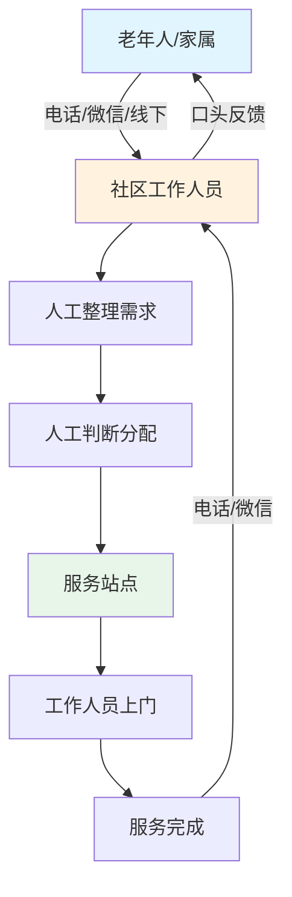

---

## 图3-2 目标业务流程图

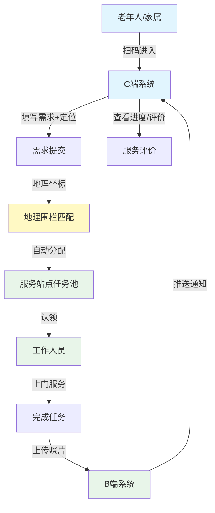

---

## 图3-3 系统功能模块图

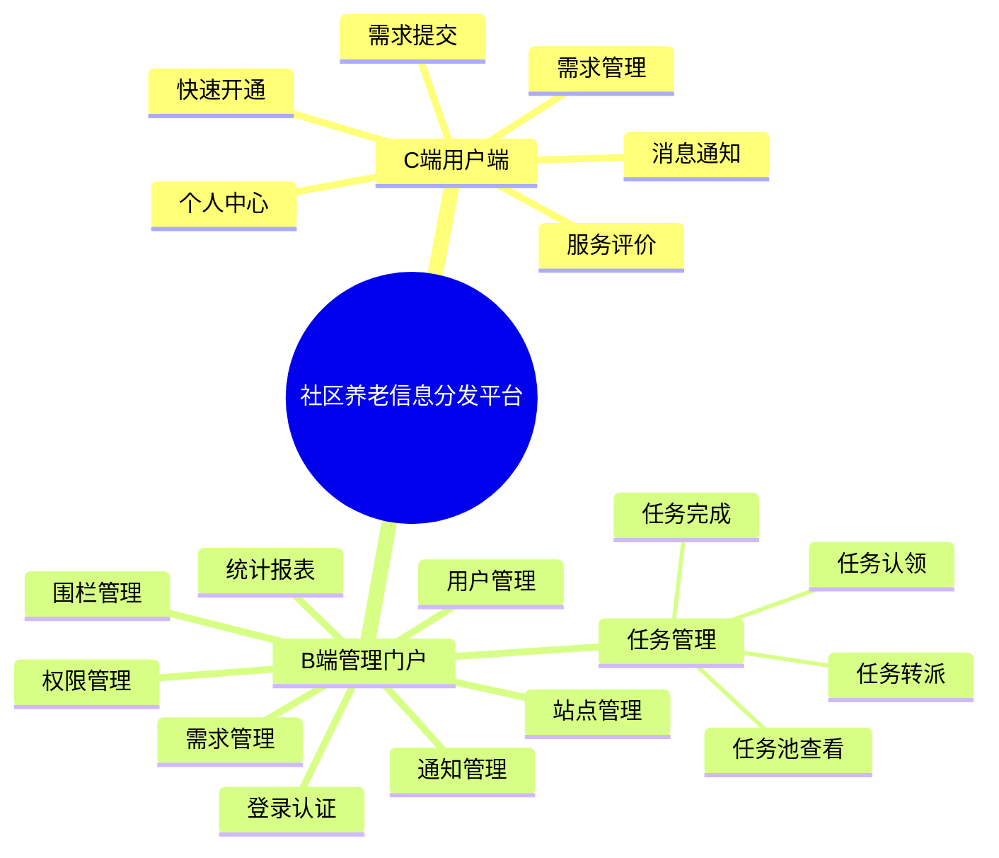

---

## 图3-4 地理围栏匹配流程图

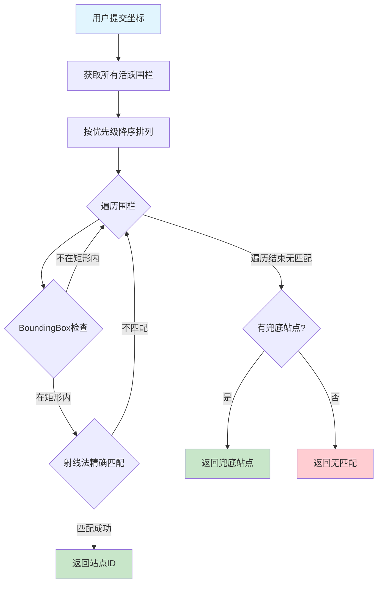

---

## 图3-5 系统用例图

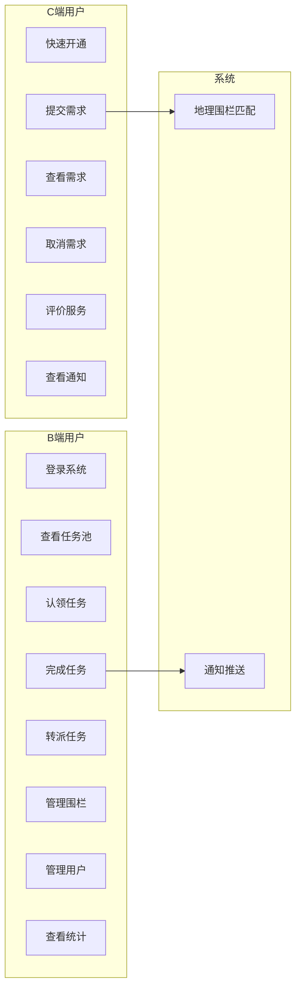

---

## 图3-6 系统E-R图

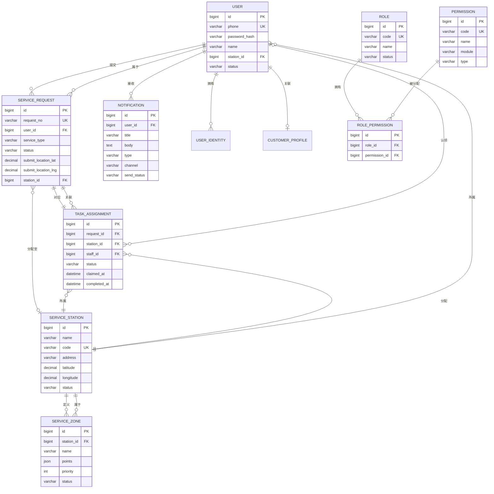

---

## 图4-1 系统架构图

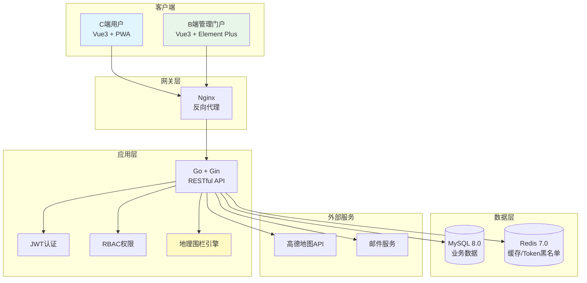

---

## 图4-2 后端分层架构图

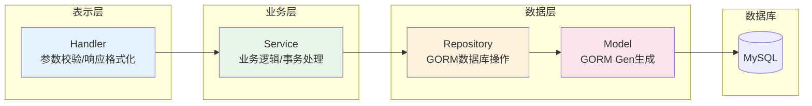

---

## 图4-3 任务状态流转图

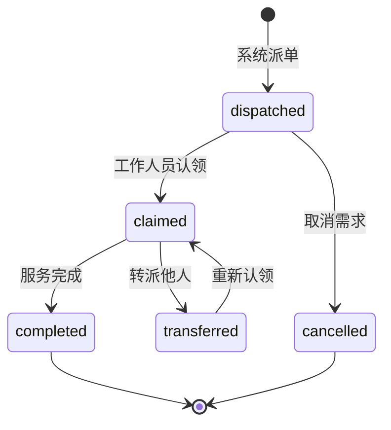

---

## 图4-4 需求状态流转图

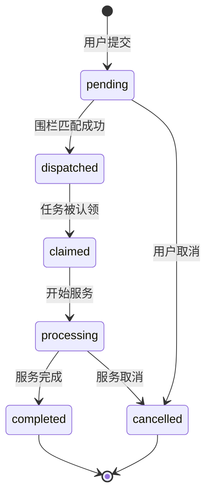

---

## 图5-1 JWT认证流程图

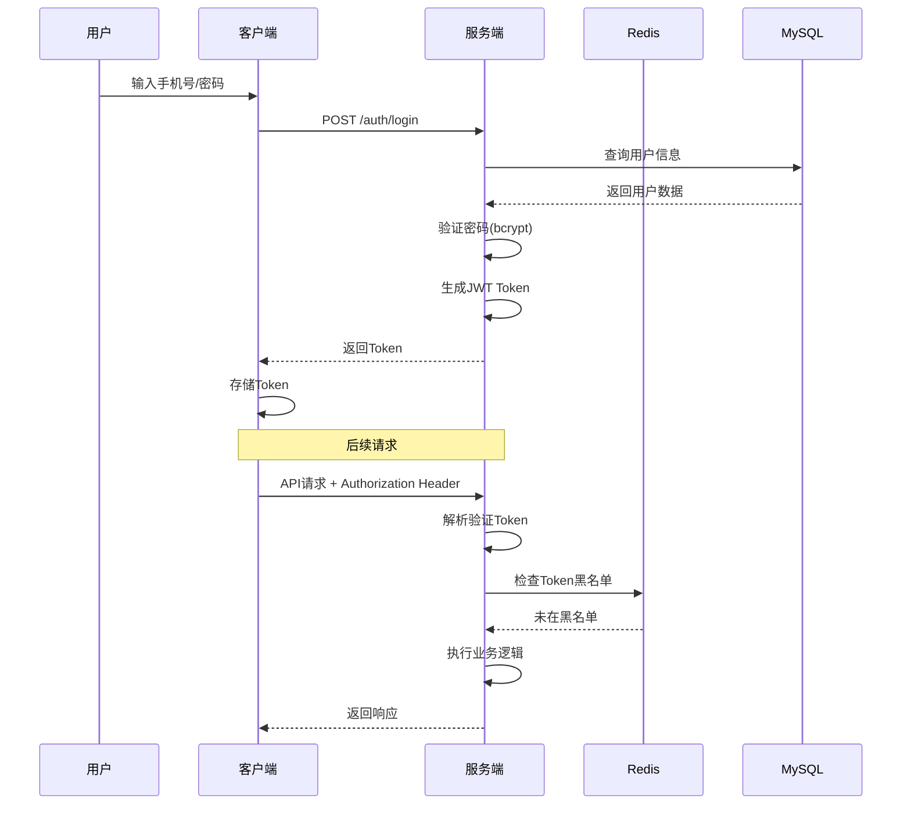

---

## 图5-2 任务认领时序图

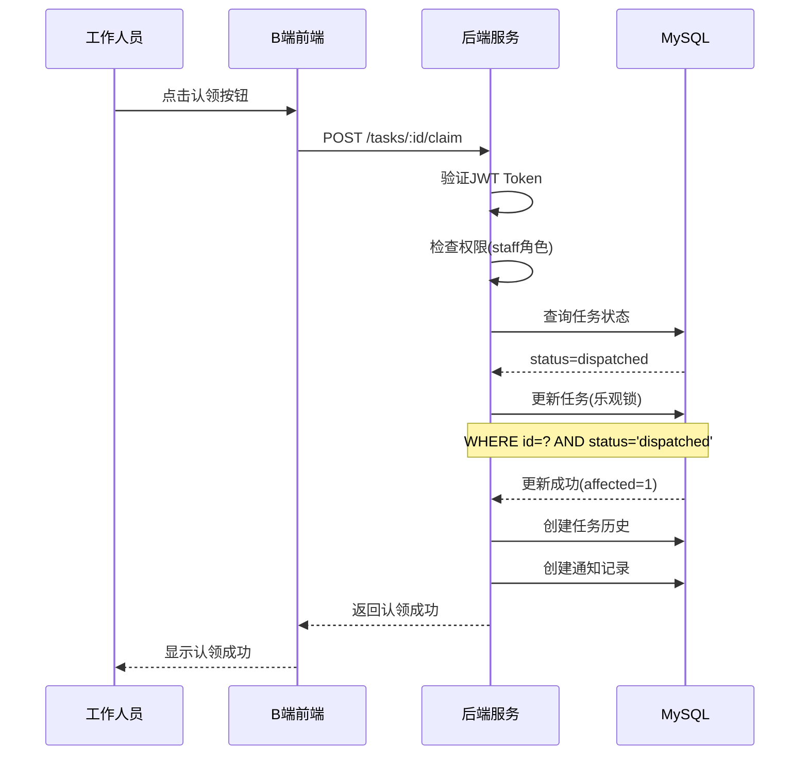

---

## 使用说明

### 方法1：在线渲染导出

1. 访问 https://mermaid.live
2. 复制上面任意图表代码粘贴
3. 点击 "Download PNG" 或 "Download SVG" 导出图片
4. 插入论文

### 方法2：Typora 渲染

1. 打开 Typora
2. 粘贴图表代码（需要用 ```mermaid 包裹）
3. 右键图表 → 导出为图片

### 方法3：VS Code 预览

1. 安装 "Markdown Preview Mermaid Support" 插件
2. 预览时即可看到渲染效果
3. 右键可导出图片

### 方法4：Draw.io 导入

1. 打开 https://app.diagrams.net
2. 高级 → 插入 → 高级
3. 粘贴 Mermaid 代码
4. 编辑后导出

---

## 图5-3 射线法原理示意图

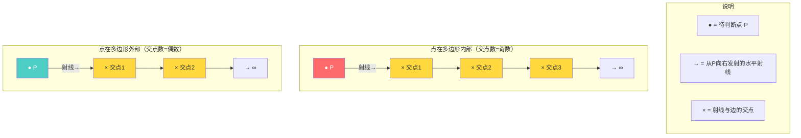

---

## 图5-3b 射线法算法流程图

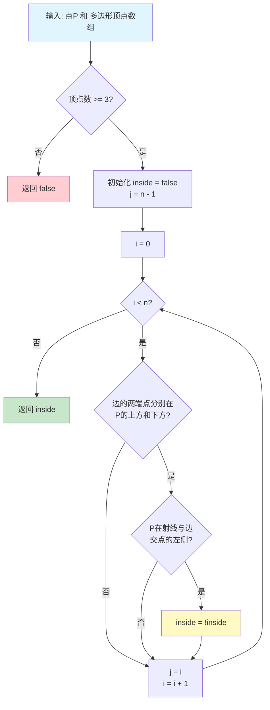
